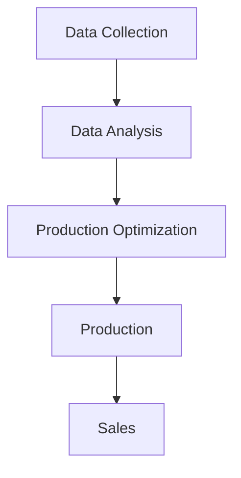
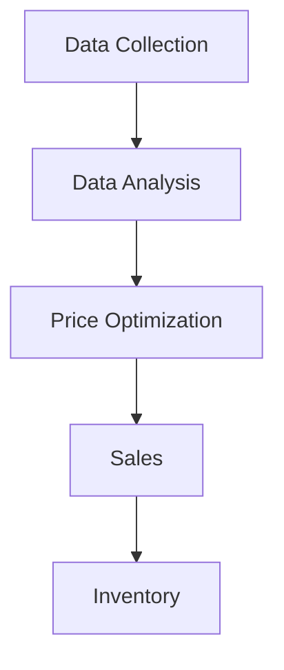
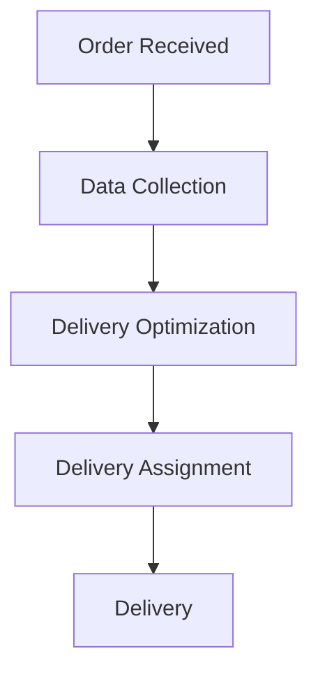

# SDG 7 and AI Solution for MacDonald's

## 1. Forecasting Demand and Optimizing Production

## 2. Dynamic Pricing Based on Inventory Levels

## 3. Calculating Delivery Route and Assigning to Nearest Delivery Person

In the first flowchart, data is collected and analyzed to optimize production and sales based on demand forecasts. In the second flowchart, data is collected and analyzed to optimize pricing based on inventory levels, with the goal of maximizing sales while minimizing waste. In the third flowchart, order data is collected and analyzed to optimize delivery routes and assign orders to the nearest available delivery person, with the goal of reducing delivery times and increasing customer satisfaction.
